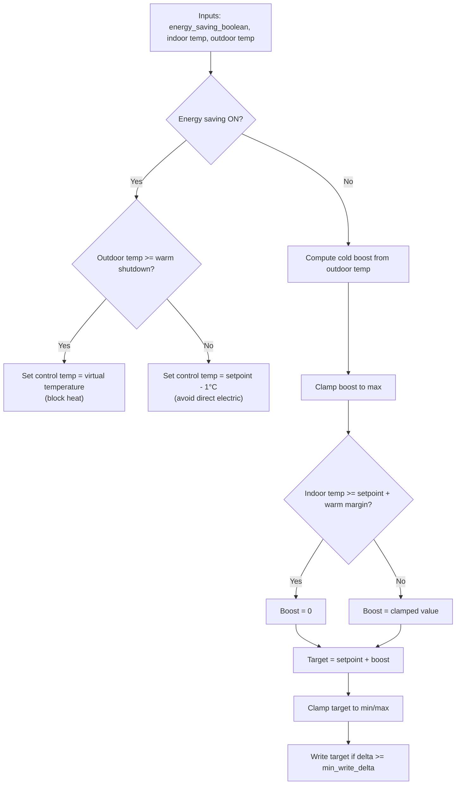

# Blockheat Home Assistant Blueprints

This repo contains a small set of Home Assistant automation blueprints focused
on policy-driven heating control for different devices and setups.

## Blueprints
- `blueprints/automation/blockheat/block-heat.yaml`
  - Outdoor-aware heatpump control with cold-boost logic and energy-saving modes.
- `blueprints/automation/blockheat/daikin-energy-saver.yaml`
  - Direct Daikin climate control that toggles between comfort and saving targets.
- `blueprints/automation/blockheat/energy_saving_policy_bool.yaml`
  - Computes a shared "energy saving" boolean based on Nordpool prices, PV, and
    optional floor temperature.
- `blueprints/automation/blockheat/floor_heat_top_minutes_with_schedule.yaml`
  - Two-state floor heat control (comfort vs soft-off) gated by policy and
    optional comfort schedule with a minimum keep temperature.

## Block Heat (Outdoor-Aware + Efficient Heatpump)
This blueprint controls a heat pump based on an energy-saving policy boolean
plus indoor/outdoor temperatures.

### Context
- The primary indoor sensor is in a bathroom with stone tiles used as thermal
  storage.
- Other rooms cool faster when it is very cold outside, so outdoor temperature
  is used to increase heating effort when needed.
- The heatpump setpoint is 20 °C by default.

### Behavior Summary
- **Energy saving = OFF**
  - Compute a cold-boost from outdoor temperature.
  - Add boost to setpoint, but suppress it if the bathroom is already warm.
  - Clamp to min/max and only write if the change is significant.

- **Energy saving = ON**
  - If outdoor temperature is **warm (>= 7 °C)**, fully block heating by writing
    the virtual temperature.
  - If outdoor temperature is **cold**, set control temperature to **setpoint - 1 °C**
    to avoid direct electric heating and favor compressor efficiency.

### Default Parameters
- Heatpump setpoint: 20 °C
- Cold boost threshold: 0 °C
- Max boost: +3 °C
- Boost slope: 1 °C boost per 5 °C drop
- Indoor warm margin: 0.3 °C
- Warm shutdown threshold (energy saving): 7 °C

### Example
- Outdoor = -10 °C
- Cold boost = (0 - (-10)) / 5 = 2 °C
- Target = 20 + 2 = 22 °C (unless bathroom is already warm)

### Flowchart

## Daikin Energy Saver (Policy-Driven)
This blueprint targets a Daikin climate entity and switches between a normal
temperature and a saving temperature based on the Energy Saving Policy boolean,
with an optional outdoor temperature guard and minimum change threshold.

## Energy Saving Policy (Top-N Price Windows)
Computes when to "save energy" (ON) vs "don't care" (OFF) by selecting the
day's most expensive 15-minute slots, with overrides for low price, high PV, or
optionally low floor temperature. Writes to an input_boolean and can run
actions on toggle.

## Floor Heat (Two-State + Schedule + Min Keep)
Controls a floor-heat thermostat using the Energy Saving Policy boolean:
soft-off during saving, comfort during non-saving. Optionally gates comfort with
a schedule and maintains a minimum keep temperature when the schedule is off.
